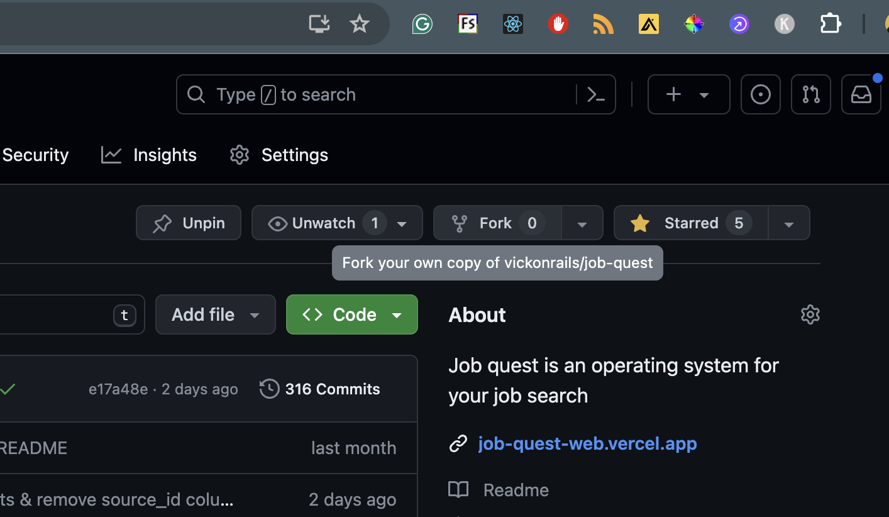
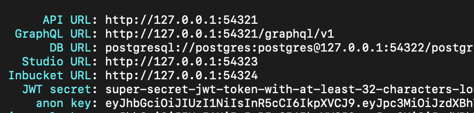
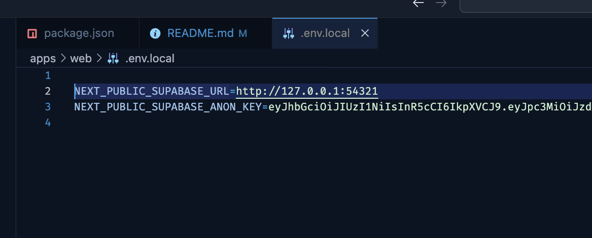
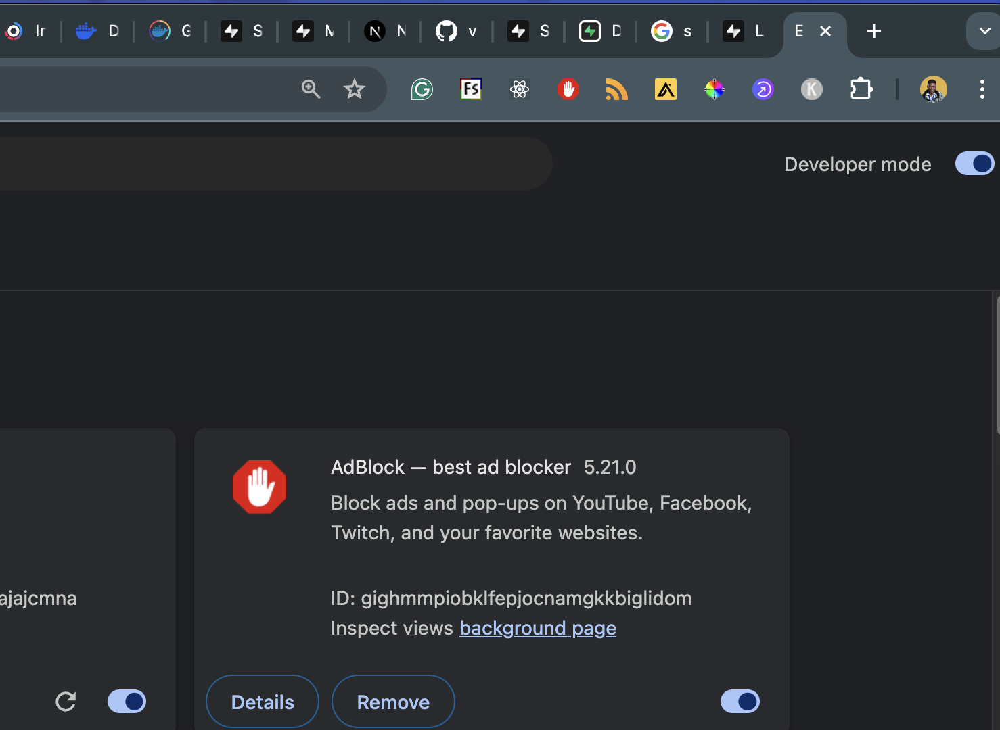

# job-quest (v0.1)


Job quest aims to be an operating system for your job search. It will be helpful if you experience 
- trouble keeping track of jobs applications
- creating effective resumes for every job application
- creative blocks when generating cover letters
- managing information about jobs you apply to

> I'm working on it on this project on my free time, so its currently a work in progress and might be quite complex to setup.

JobQuest comes with the following
- job tracker
- resume builder
- browser extension to collect jobs

## Features
- [x] Job Fetcher Browser Extension
    - [ ] Browser extension authentication
    - [ ] Cross browser testing
    - [ ] Support for moving extension across the page
    - [x] LinkedIn support
    - [x] Other sites
- [x] Authentication
    - [x] Magic link
    - [ ] Google OAuth
- [ ] Job Tracker
    - [x] Kanban view
- [x] Notes
    - [x] Implement notes feature
    - [ ] RTE in notes
- [ ] Reminders
- [ ] Contacts
- [ ] Resume builder
    - [ ] 5 resume templates
    - [ ] Autosave in Resume builder
    - [ ] RTE in resume highlights
    - [ ] PDF export service
- [ ] UI Improvements
    - [ ] Dark mode support 

## Local Setup
You can setup JobQuest on your local machine by following the steps below

### Tech Stack

- [Next.js](https://nextjs.org/) - React framework
- [Turborepo](https://turbo.build/repo/docs/installing) - Monorepo workflow
- [Tailwind](https://tailwindcss.com/) - CSS
- [Supabase](https://supabase.com/docs/guides/cli/managing-environments) - Backend
- [Plasmo](https://plasmo.com/) - Browser extension framework
- [Vercel](https://vercel.com/) - Hosting

### Prerequisites
To get started, you should ensure the following is installed on your machine

- [Supabase CLI](https://supabase.com/docs/guides/cli/getting-started)
- [Docker](https://docs.docker.com/get-docker/) - for running supabase locally
- [Turborepo](https://turbo.build/repo/docs/installing)

### Setup Guide

1. Fork project



2. Clone your fork

```
git clone https://github.com/<your-username>/job-quest.git
```

3. Install project

```
cd job.quest && yarn
```

4. Setup Supabase

    - Confirm you have supabase installed by typing

    ```
    npx supabase
    ```

    - Start the supabase docker service (ensure the docker daemon is running)

    ```
    npx supabase start
    ```

    - It should output the following variables. You can go ahead to put them in your `web/.env.local` file

        

    - Setup env variables
        


5. Run `yarn dev` to start `web` & `extension` packages

```
yarn dev
```

6. Setup chrome extension (Currently chrome only)
- Enable developer mode in your browser & click on `load unpacked`
    
- Select the `chrome-mv3-dev` folder in `job.quest/apps/extension/build/` folder
- Visit `linkedIn.com`, navigate to a job listing page.

### Demos

Adding Job from LinkedIn browser


Tracking Job Applications


## Deployment guide
> Coming soon! 